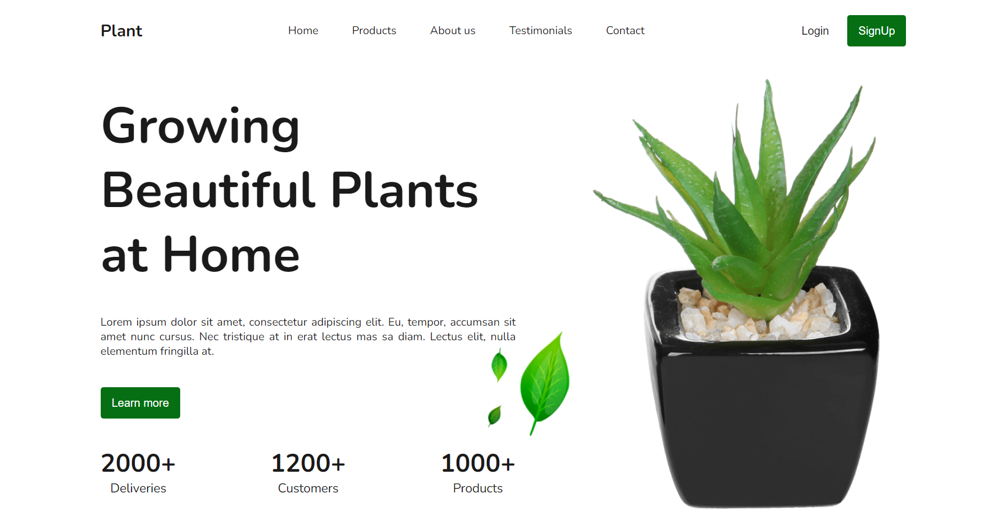

# Plant Shop

Plant Shop is a responsive landing page built with HTML and CSS. It features a modern design and smooth scrolling navigation using anchor links.

## Features

- Fully responsive and adaptive design.
- Smooth scrolling navigation with anchor links.
- Use of CSS variables for easy theming.

## Tech Stack

- HTML
- CSS (with CSS variables)
- Font awesome

## Access the App

You can access the application at the following link: [Plant Shop](https://nataly-horbunova.github.io/plant_shop/)

## Screenshots

_Home_

  

_Testimonials_

_About_

## Getting Started

git clone https://github.com/Nataly-Horbunova/plant_shop.git

cd plant-shop
